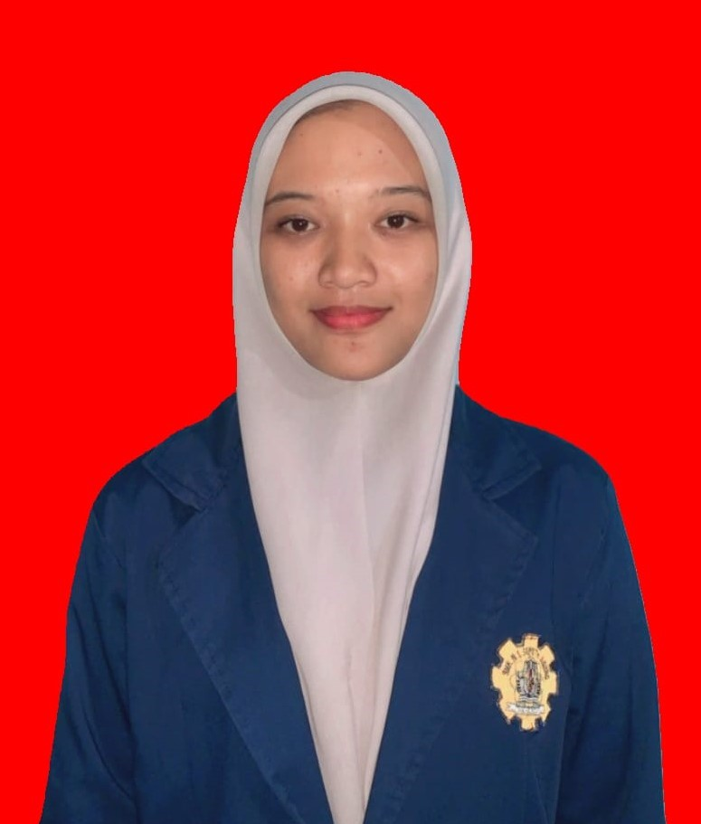

<html lang="id">
<head>
    <meta charset="UTF-8">
    <meta name="viewport" content="width=device-width, initial-scale=1.0">
    <title>Portofolio Saya</title>
    <link href="https://fonts.googleapis.com/css2?family=Poppins:wght@300;400;600&family=Roboto:wght@300;400;500&display=swap" rel="stylesheet">
    
</head>
<body>
    <header>
        <h1>JAUZAA HANIIFAH</h1>
        <h1>2413025004</h1>
        
        
PENDIDIKAN TEKNOLOGI INFORMASI

        
UNIVERSITAS LAMPUNG

        <nav>
            <ul>
                <li><a href="#about">Tentang</a></li>
                <li><a href="#projects">Proyek</a></li>
                <li><a href="#contact">Kontak</a></li>
            </ul>
        </nav>
    </header>

    <section id="about">
        <h2>Tentang Saya</h2>

        <h3>Domisili</h3>
        
Seputih Agung, Lampung Tengah.

        <h3>Alumni</h3>
        
SMKN 1 Seputih Agung dari jurusan Teknik Komputer dan Jaringan.

        <h3>Pendidikan Saat Ini</h3>
        
Saat ini saya adalah mahasiswa aktif di Universitas Lampung dari Fakultas Keguruan dan Ilmu Pendidikan,
           Jurusan Pendidikan Matematika dan Ilmu Pengetahuan Alam angkatan 2024 kelas B. Saya memiliki minat besar di bidang IT dan pendidikan serta berkomitmen untuk mengintegrasikan teknologi 
           dalam proses pembelajaran guna menciptakan pengalaman belajar yang lebih efektif dan interaktif bagi siswa.

    </section>

    <section id="projects">
        <h2>Proyek Saya</h2>
        <ul>
            <li>
                <h3>Tugas 1</h3>
                
Tokoh Grafika Komputer.

                <a href="https://drive.google.com/file/d/1xUJ5btI89289Fnv2wH_N4EEUbyBUkUrm/view?usp=sharing">PPT</a>
                <a href="https://drive.google.com/file/d/1WIXVqttwRud-84u6qE25bTHpPo4f6b1K/view?usp=sharing">Makalah</a>
                <a href="https://drive.google.com/file/d/1QnU1JaUtGDaeaCksWibMHGxpwa9JPtUQ/view?usp=sharing">Video</a>
            </li>
            <li>
                <h3>Tugas 2</h3>
                
Pembentukan Garis Menggunakan Algoritma DDA.

                <a href="https://drive.google.com/file/d/1L9qMdk9Z0dX5Pr6GQ5MwswDD4LSlL09e/view?usp=sharing">Makalah</a>
                <a href="https://drive.google.com/file/d/1wdGXq4ZUakcCGU1siSPaFs4wlMSQUT1Y/view?usp=sharing">Video</a>
            </li>
            <li>
                <h3>Tugas 3</h3>
                
Pembentukan Lingkaran Menggunakan Algoritma Bresenham dan Midpoint

                <a href="https://drive.google.com/file/d/1ux8oafe7s3-nTud5X_sULRLTSKl7kNMH/view?usp=sharing">Makalah</a>
                <a href="https://drive.google.com/file/d/1Yr_PNqgoOJH0gW5xBm8X84nCZQ3L2CeD/view?usp=sharing">Video</a>
            </li>
            <li>
                <h3>Tugas 4</h3>
                
Pembentukan Kurva Menggunakan Algoritma Bezier

                <a href="https://drive.google.com/file/d/1GxD6Mmo5ZLSajn_HsW5UxVLbUVLSKNsF/view?usp=sharing">Makalah</a>
                <a href="https://drive.google.com/file/d/1o8fMMbYpt0PrY3sitAFI3IYs-xgFmsIp/view?usp=drive_link">Video</a>
            </li>

    <section id="contact">
        <h2>Kontak</h2>
        
Email: <a href="mailto:jauzaahaniifah@gmail.com">jauzaahaniifah@gmail.com</a>

        
Instagram: <a href="https://www.instagram.com/jzaahnfhh?igsh=dWFtbHdpbzZuNWJn">instagram</a>

    </section>

    <footer>
        
&copy; Tugas Grafika Komputer.

    </footer>

    
</body>
</html>
